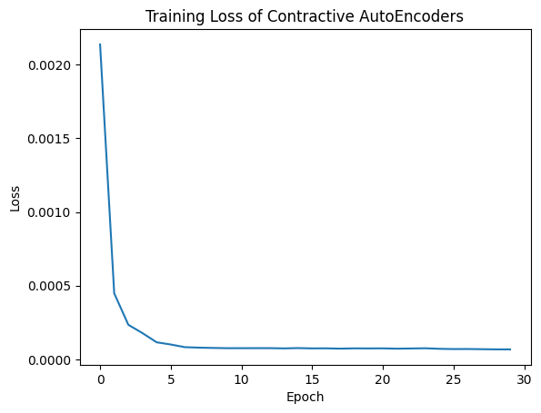
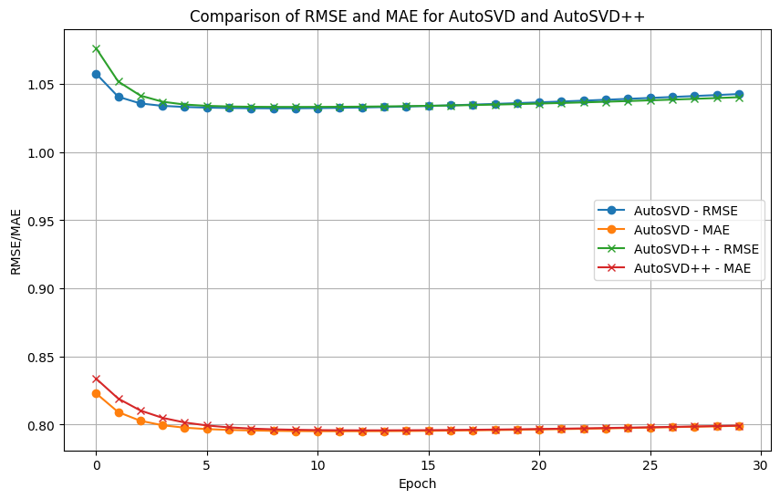
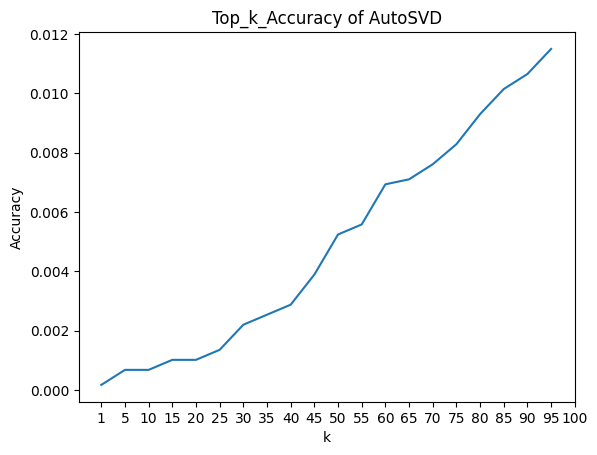
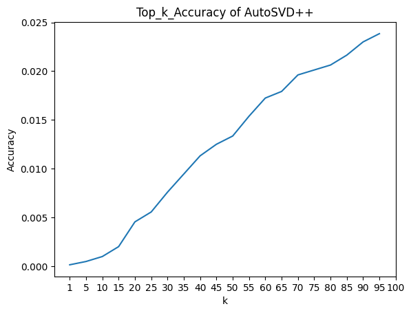

# AutoSVD++: An Efficient Hybrid Collaborative Filtering Model via Contractive Auto-encoders

## What we've used and modified
We've used the same model architecture for AutoSVD and AutoSVD++ from:
AutoSVD++ paper: https://github.com/cheungdaven/autosvdpp/tree/master

We've changed and added:
- Data: Generated subset of Yelp dataset
- Data loader for Yelp: ./utils/LoadDataSet.py
  - Original model built for MovieLens 100k and MovieLens 1M datasets. In order to get the recommendation for restaurant, we reimplemented the data loader to have the same input format: userID\t itemID\t rating\t timestamp (optional)
- Feature representation via Contractive AntoEncoders: ./utils/ContractiveAutoEnconder.py
  - Extracted restaurant features: ./datasets/samplesets/restaurant_features_encoded.csv
- Yelp recommendation generator: ./utils/YelpRecommendationGenerator.py
  - Randomly generate a sample user, predict the ratings that the user will give to each business, and provides top-k recommendations 
- Training and analysis code: Training.ipynb
  - Build and train AutoSVD and AutoSVD++: main_AutoSVD.py and main_AutoSVDpp.py
- Inferencing and evaluation code: Inference.ipynb
  - Load pretrained AutoSVD and AutoSVD++ and make predictions and recommendations: predict_AutoSVD.py and predict_AutoSVDpp.py
- Training configuration such as training hyperparameters and evaluation metrics: ./parameters/

## Training and Inference Data Statistics

### Training data

| Model            | CAE              | AutoSVD    | AutoSVDpp  |
|------------------|------------------|------------|------------|
| Completion Time  |   8min 36s       | 2min 26s   | 3min 52s   |

CAE Loss Curve \

AutoSVD++ Loss Curve \

- AutoSVD: RMSE = 1.043, MAE = 0.799 
- AutoSVDpp: RMSE = 1.040, MAE = 0.799

### Testing data

| Model/Task           | Top-1 Acc              | Top-5 Acc    | Top-10 Acc  | Top-10 Rec (single user) | Predict (all usres)
|------------------|------------------|------------|------------| ------------|------------|
| AutoSVD |   5.3s       | 5.27s   | 5.52s   | 8.24s | 16min 2s |
| AutoSVDpp |   5.32s       | 5.45s   | 5.24s   | 14.3s | 15min 13s

AutoSVD \

AutoSVDpp \

