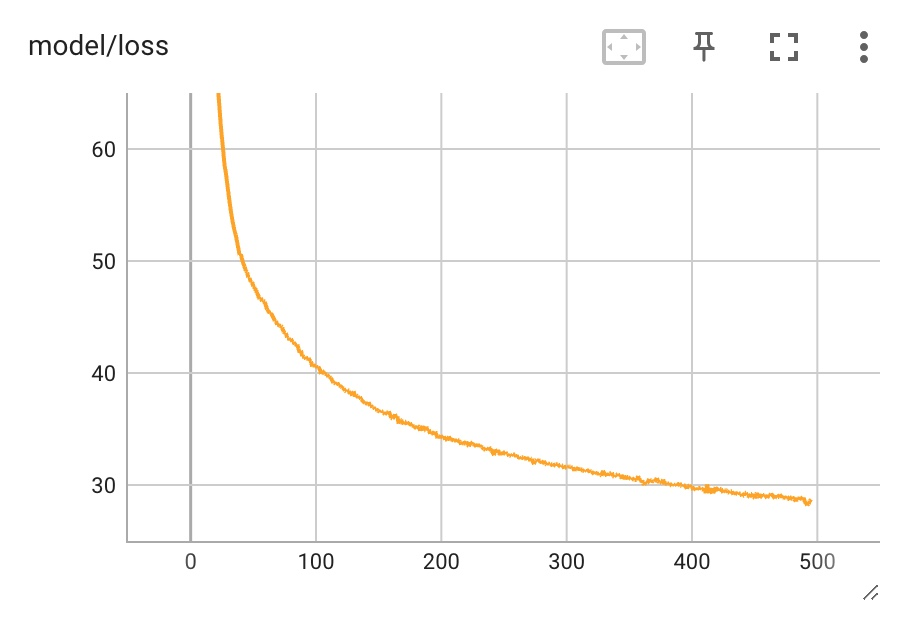
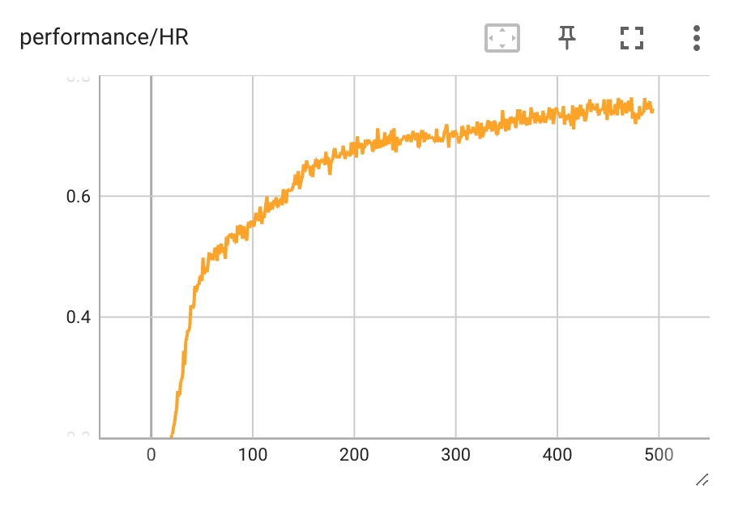
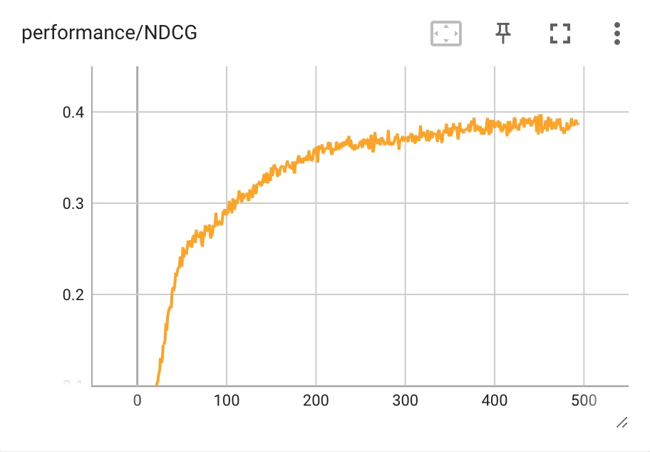
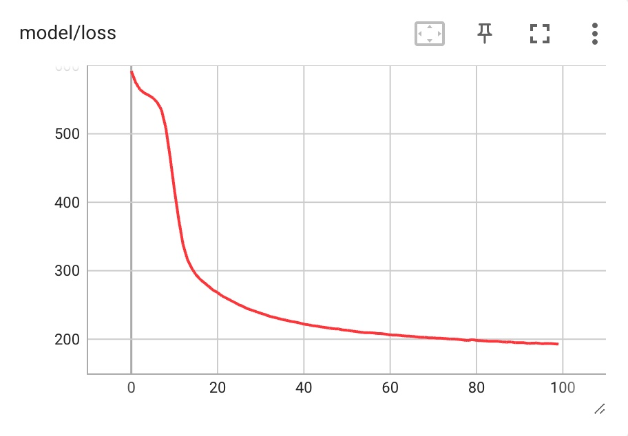
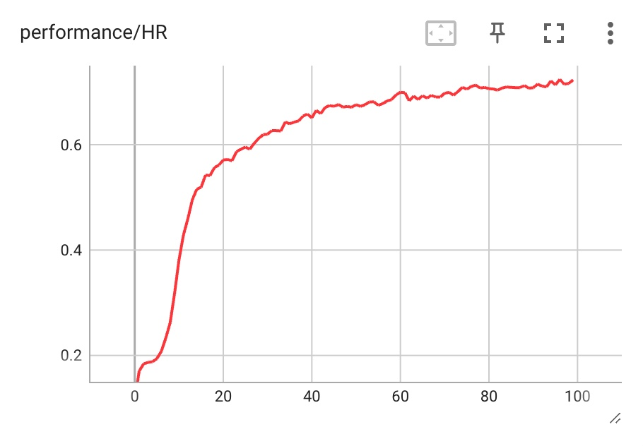
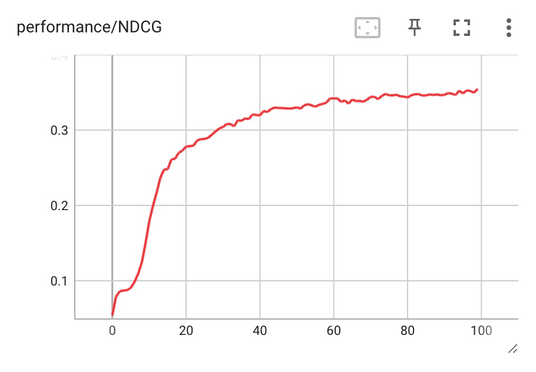

# Neural Collaborative Filtering Model

## What we've used and modified
We've used:
- NCF original: https://github.com/hexiangnan/neural_collaborative_filtering
- Pytorch version implementation: https://github.com/yihong-chen/neural-collaborative-filtering

We've changed and added:
- Data: Subset of Yelp dataset
- Data loader: `./Torch-NCF/data.py` 
  - Original model built for MovieLens 1 Million (ml-1m) and Pinterest (pinterest-20) dataset. In order to get the recommendation for restaurant, we reimplemented the dataloader to have the same input format: userID\t itemID\t rating\t timestamp (optional)
- Inferencing code: `inference.py`
- Training configuration: `./Torch-NCF/train.py`

## Train and Test Data Statistics

### Training data
| User  | Item (Business)  | Interaction (Review)  | Size   | Training Time |
|-------|------------------|-----------------------|--------|-------------|
| 1000  | 1000             | 48,671                | 54.6MB | 47m         |
| 3000  | 3000             | 186,484               | 195.7MB| N/A         |
| 4000  | 4000             | 257,494               | 264.9MB| N/A         |
| 5000  | 5000             | 325,628               | 330.2MB| 3h 42m 15s  |

### Testing data
Two different evaluation dataset for the NCF model. The **first evaluation** is done while training, the test/train split is 0.2. \
**Second evaluation** test subset is generated by our group.

## First Evaluation 
### Model trained with 1k users (500 epochs)
Loss Curve

Hit Rate: 0.7447

NDCG: 0.3877

### Model trained with 5k users (100 epochs)
Loss Curve

Hit Rate: 0.7227

NDCG: 0.3547

## Second Evaluation
With the test subset generated by our group. 

| Total User  | Tested User  | Missed User  | True Predction  | Evaluation Time |
|-------------|--------------|--------------|-----------------|-----------------|
| 5828        | 1325         | 4503         | 0               | 3h 5m           |